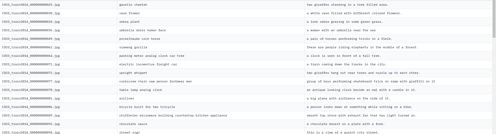

# Outils de traitement de corpus

## Tâche choisie : Légendage d'Images (Image-to-Text)

- La tâche consiste à transformer des images en descriptions textuelles qui capturent le contenu et le contexte visuels de l'image.
- **Type de la tâche**: Vision par ordinateur combinée au traitement du langage naturel (NLP).
-
## Corpus choisi: Textual-Image-Caption Dataset par AhmedSSabir
Le "Textual-Image-Caption Dataset" peut être utilisé pour entraîner ou évaluer des modèles sur la tâche de légendage d'images.

Ce dataset contient trois colonnes :
1. **Image ID**: Identifiant unique pour chaque image, généralement le nom du fichier.
2. **Keywords** : Mots-clés ou tags qui résument les objets ou les concepts présents dans l'image.
3. **Caption** : Description textuelle complète de ce que montre l'image, utilisée pour le légendage.
Ce type de dataset est couramment utilisé pour les tâches de légendage automatique d'images, où le but est de développer des modèles capables de comprendre le contenu visuel d'une image et de le décrire en phrases naturelles.

- **Modèle utilisant ce corpus**: Bien qu'on puisse utiliser divers modèles pour cette tâche, un modèle comme `ydshieh/vit-gpt2-coco-en` sur Hugging Face a été mentionné. Ce modèle combine ViT (Vision Transformer) pour la compréhension d'image et GPT-2 pour la génération de texte, optimi

- **Autres modèles**: Des architectures comme Transformer ont été utilisées pour ce type de tâche. Des modèles spécifiques incluent `OpenAI's CLIP` associé à des modèles de génération de texte comme GPT, ou `Google's BERT` associé à des modèles de vision, tels que ResNet.

- **Langue**: Anglais uniquement
**Corpus similaires disponibles dans d'autres langues** :
1. **Flickr30k**: Ce dataset comprend 31,000 images collectées à partir de Flickr, chacune accompagnée de cinq légendes différentes rédigées par des humains, principalement en anglais. Des versions multilingues comme Flickr30k Entities ont été développées.

2. **Multi30k**: Ce dataset offre des descriptions non seulement en anglais mais aussi en allemand, français et tchèque.

3. **STAIR**: Un corpus de légendage d'images en japonais.

